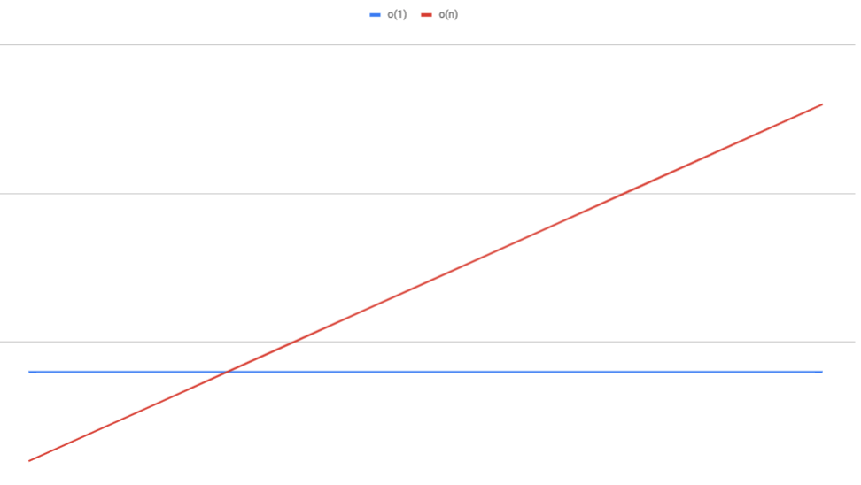
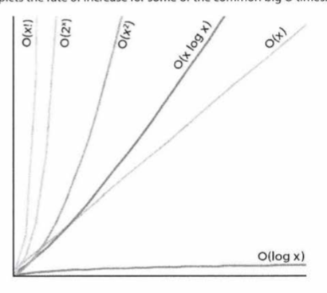

import { syntaxHighlighterPrism } from "mdx-deck/themes";
import { book } from "@mdx-deck/themes";
import customTheme from "./theme";
import { Split } from "mdx-deck/layouts";
export const themes = [book, syntaxHighlighterPrism, customTheme];
import { Appear } from "mdx-deck";

# Big O

#### Matthew Lawson

---

# What is it?

### Expressing how the runtime of an algorithm scales in relation to it's input.

---

# For example

---



---

```javascript
function iterate(a) {
  for (let i = 0; i < a.length; i++) {
    console.log(a[i]);
  }
}
```

<Appear>
  <h4>O(n)✅</h4>
</Appear>

---

```javascript
function iterate(a) {
  for (let i = 0; i < a.length; i++) {
    console.log(a[i]);
  }
  for (let i = 0; i < a.length; i++) {
    console.log(a[i]);
  }
}
```

<Appear>
  <h4>O(2n) ❌</h4>
  <h4>O(n) ✅</h4>
</Appear>

---

# Rule 1

## Drop constants

O(2n) becomes O(n).

We are only interested in how things scale

---

```javascript
function iterate(a, b) {
  for (let i = 0; i < a.length; i++) {
    console.log(a[i]);
  }
  for (let i = 0; i < b.length; i++) {
    console.log(b[i]);
  }
}
```

<Appear>
  <h4>O(n) ❌</h4>
  <h4>O(a + b) ✅</h4>
</Appear>

---

# Rules 2

## Steps are added

Bonus rule: not everything has to be expressed as "n". Different variables need different labels

---

```javascript
function iterate(a) {
  for (let i = 0; i < a.length; i++) {
    console.log(a[i]);
  }
  for (let i = 0; i < a.length; i++) {
    for (let j = 0; j < a.length; j++) {
      console.log(a[i], a[j]);
    }
  }
}
```

<Appear>
  <h4>
    O(a + a<sup>2</sup>) ❌
  </h4>
  <h4>
    O(a<sup>2</sup>) ✅
  </h4>
</Appear>

---

# Rule 3

## Drop non-dominant terms

O(n + n<sup>2</sup>) becomes O(n<sup>2</sup>) because O(n) < O(n<sup>2</sup>)

---

Examples ...

---

```javascript
function linearSearch(terms, searchTerm) {
  for (let i = 0; i < terms.length; i++) {
    if (terms[i] == searchTerm) {
      return true;
    }
  }
  return false;
}
```

<Appear>
  <h4>O(n) ✅</h4>
</Appear>

---

```javascript
function linearSearch(terms, searchTerm) {
  terms.find(function(item) {
    return item == searchTerm;
  });
}
```

<Appear>
  <h4>O(n) ✅</h4>
  <h4>We need to take into consideration library functions too</h4>
</Appear>

---

```javascript
/**
 *  Map<string, string> termMap
 *  String searchTerm
 * */
function linearSearch(termMap, searchTerm) {
  return termMap.get(searchTerm);
}
```

<Appear>
  <h4>O(1) ✅</h4>
  <h4>Map lookups are O(1)</h4>
</Appear>

---

```javascript
/**
 *  Map<string, string> termMap
 *  String searchTerm
 * */
function linearSearch(termMap, searchTerm) {
  return termMap.get(searchTerm);
}
```

<Appear>
  <h4>O(1) ✅</h4>
  <h4>Map lookups are O(1)</h4>
</Appear>

---

```javascript
function printPairs(a) {
  for (let i = 0; i < a.length; i++) {
    for (let j = 0; j < a.length; j++) {
      console.log(a[i], a[j]);
    }
  }
}
```

<Appear>
  <h4>
    O(a<sup>2</sup>) ✅
  </h4>
</Appear>

---

```javascript
function printAndrepeatPairs(a) {
  for (let k = 0; k < 10000; k++) {
    for (let i = 0; i < a.length; i++) {
      for (let j = 0; j < a.length; j++) {
        console.log(a[i], a[j]);
      }
    }
  }
}
```

<Appear>
  <h4>
    O(a<sup>3</sup>) ❌
  </h4>
  <h4>
    O(10000a<sup>2</sup>) ❌
  </h4>
  <h4>
    O(a<sup>2</sup>) ✅
  </h4>
  <h4>
    The 10,000 is constant so can be reduced to just a<sup>2</sup>
  </h4>
</Appear>

---

`// a is an unsorted array of ints`

```javascript
function printMax(a) {
  let max = 0;
  for (let i = 0; i < a.length; i++) {
    Math.max(max, a[i]); // constant time
  }
  return max;
}
```

```javascript
function printMax(a) {
  a = a.sort((a, b) => b - a); // Sorts items descending
  return a[0]; // Direct index access is O(1)
}
```

<Appear>
  <h4>#1 is O(n) ✅</h4>
  <h4>sort functions are typically O(n log n) ✅</h4>
  <h4>O(n) less than O(n log n) so #1 is quicker ✅</h4>
</Appear>

---

## Other Runtimes

---

# O(log n)

### Typically when the amount of iterations is cut in half on each loop, eg a binary search

```javascript
function logN(a) {
  let x = a.length;
  while (x > 0) {
    x = x / 2;
  }
}
```

---

# O(n log n)

### Most sorting algorithms are (n log n)

#### When choosing a sorting algorithm you need to consider the best / average / worst time complexity and match it to any attributes you may know about your data.

#### For example quicksort runs at n<sup>2</sup> on an already sorted array (depending on implementation)

---



---

# Closing thoughts

<ul>
<Appear>
<li>You know your data best and readbility / maintainabillity may be preferable over pure performance.</li>

<li>
  If n is small how you access / tranform it will probably be fast regardless
</li>
<li>Having a common language to talk about performance makes comparison of algorithms easier</li>
</Appear>
</ul>

---

# O(🔥)
